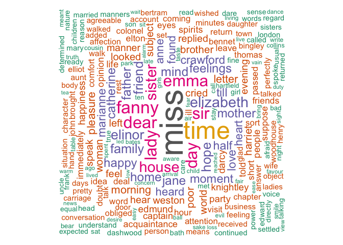
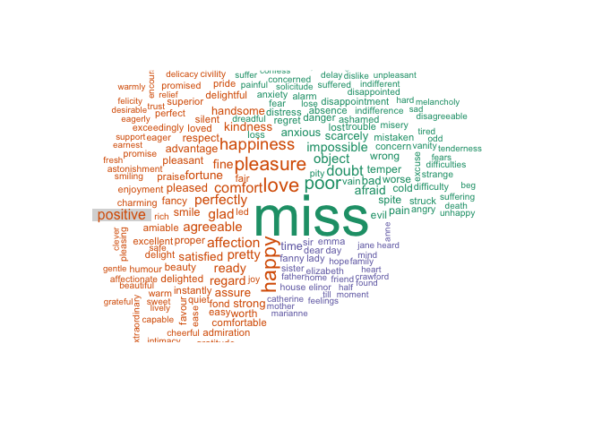
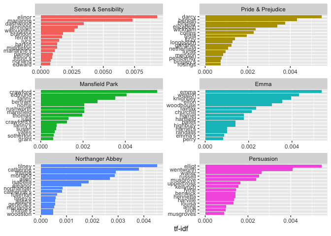

Basic text wrangling
================

## Let’s start with the basics

One of the best libraries for text mining is
[`tidytext`](%5B)<https://www.tidytextmining.com/>)

``` r
library(tidytext)
library(janeaustenr)
library(dplyr)
library(stringr)

original_books <- austen_books() 

original_books  
```

    ## # A tibble: 73,422 x 2
    ##    text                  book               
    ##  * <chr>                 <fct>              
    ##  1 SENSE AND SENSIBILITY Sense & Sensibility
    ##  2 ""                    Sense & Sensibility
    ##  3 by Jane Austen        Sense & Sensibility
    ##  4 ""                    Sense & Sensibility
    ##  5 (1811)                Sense & Sensibility
    ##  6 ""                    Sense & Sensibility
    ##  7 ""                    Sense & Sensibility
    ##  8 ""                    Sense & Sensibility
    ##  9 ""                    Sense & Sensibility
    ## 10 CHAPTER 1             Sense & Sensibility
    ## # … with 73,412 more rows

Adding linenumbers and chapters

``` r
original_books <- original_books %>%   
  group_by(book) %>%
  mutate(linenumber = row_number(),
         chapter = cumsum(str_detect(text, regex("^chapter [\\divxlc]",
                                                 ignore_case = TRUE)))) %>%
  ungroup()

original_books
```

    ## # A tibble: 73,422 x 4
    ##    text                  book                linenumber chapter
    ##    <chr>                 <fct>                    <int>   <int>
    ##  1 SENSE AND SENSIBILITY Sense & Sensibility          1       0
    ##  2 ""                    Sense & Sensibility          2       0
    ##  3 by Jane Austen        Sense & Sensibility          3       0
    ##  4 ""                    Sense & Sensibility          4       0
    ##  5 (1811)                Sense & Sensibility          5       0
    ##  6 ""                    Sense & Sensibility          6       0
    ##  7 ""                    Sense & Sensibility          7       0
    ##  8 ""                    Sense & Sensibility          8       0
    ##  9 ""                    Sense & Sensibility          9       0
    ## 10 CHAPTER 1             Sense & Sensibility         10       1
    ## # … with 73,412 more rows

Getting words out of the sentences

``` r
tidy_books <- original_books %>%
  unnest_tokens(word, text)

tidy_books
```

    ## # A tibble: 725,055 x 4
    ##    book                linenumber chapter word       
    ##    <fct>                    <int>   <int> <chr>      
    ##  1 Sense & Sensibility          1       0 sense      
    ##  2 Sense & Sensibility          1       0 and        
    ##  3 Sense & Sensibility          1       0 sensibility
    ##  4 Sense & Sensibility          3       0 by         
    ##  5 Sense & Sensibility          3       0 jane       
    ##  6 Sense & Sensibility          3       0 austen     
    ##  7 Sense & Sensibility          5       0 1811       
    ##  8 Sense & Sensibility         10       1 chapter    
    ##  9 Sense & Sensibility         10       1 1          
    ## 10 Sense & Sensibility         13       1 the        
    ## # … with 725,045 more rows

Counting words

``` r
tidy_books %>%
  count(word, sort = TRUE) 
```

    ## # A tibble: 14,520 x 2
    ##    word      n
    ##    <chr> <int>
    ##  1 the   26351
    ##  2 to    24044
    ##  3 and   22515
    ##  4 of    21178
    ##  5 a     13408
    ##  6 her   13055
    ##  7 i     12006
    ##  8 in    11217
    ##  9 was   11204
    ## 10 it    10234
    ## # … with 14,510 more rows

### Removing stopwords

``` r
data(stop_words)

tidy_books <- tidy_books %>%
  anti_join(stop_words)

tidy_books %>%
  count(word, sort = TRUE) %>% head(10)
```

    ## # A tibble: 10 x 2
    ##    word       n
    ##    <chr>  <int>
    ##  1 miss    1855
    ##  2 time    1337
    ##  3 fanny    862
    ##  4 dear     822
    ##  5 lady     817
    ##  6 sir      806
    ##  7 day      797
    ##  8 emma     787
    ##  9 sister   727
    ## 10 house    699

If you want stopwords eg. in Finnihs, you have to collect fetch them
somewhere or collect them yourself.

``` r
library(jsonlite)

stopwords_fin <- fromJSON('https://raw.githubusercontent.com/stopwords-iso/stopwords-fi/master/stopwords-fi.json')

##make a df
stopwords_fin <- stopwords_fin %>% 
  as.data.frame()

stopwords_fin %>% head()
```

    ##             .
    ## 1     aiemmin
    ## 2        aika
    ## 3       aikaa
    ## 4      aikaan
    ## 5 aikaisemmin
    ## 6    aikaisin

``` r
names(stopwords_fin)[1]<-"word"
```

## Stemming words

``` r
library(SnowballC)
library(corpus)

tidy_books_stemmed <- tidy_books %>%
  mutate(word_stemmed1 = corpus::stem_snowball(word, algorithm = "en"),
         word_stemmed2 = SnowballC::wordStem(word, language = "en"))

tidy_books_stemmed
```

    ## # A tibble: 217,609 x 6
    ##    book            linenumber chapter word      word_stemmed1 word_stemmed2
    ##    <fct>                <int>   <int> <chr>     <chr>         <chr>        
    ##  1 Sense & Sensib…          1       0 sense     sens          sens         
    ##  2 Sense & Sensib…          1       0 sensibil… sensibl       sensibl      
    ##  3 Sense & Sensib…          3       0 jane      jane          jane         
    ##  4 Sense & Sensib…          3       0 austen    austen        austen       
    ##  5 Sense & Sensib…          5       0 1811      1811          1811         
    ##  6 Sense & Sensib…         10       1 chapter   chapter       chapter      
    ##  7 Sense & Sensib…         10       1 1         1             1            
    ##  8 Sense & Sensib…         13       1 family    famili        famili       
    ##  9 Sense & Sensib…         13       1 dashwood  dashwood      dashwood     
    ## 10 Sense & Sensib…         13       1 settled   settl         settl        
    ## # … with 217,599 more rows

### Stemming in Finnish

Ain’t that easy..

Let’ get some data from twitter. For this you need API keys, only
available nowadays upon request. Try your luck\! Tutorial
[here](https://towardsdatascience.com/access-data-from-twitter-api-using-r-and-or-python-b8ac342d3efe)

I save my credentials nowadays in .Renviron file and add that file also
to .gitignore in order to avoid pushing some secrect stuff in a repo.
More on that eg.
[here](https://csgillespie.github.io/efficientR/3-3-r-startup.html#renviron).

``` r
readRenviron('.Renviron') 
library(twitteR)
setup_twitter_oauth(Sys.getenv("consumer_key"), Sys.getenv("consumer_secret"), Sys.getenv("access_token"), Sys.getenv("access_secret"))
```

    ## [1] "Using direct authentication"

``` r
### Search some tweets ##
tweets= searchTwitter('naiset', n = 1000, lang = "fi")
# store the tweets into dataframe
tweets_df = twListToDF(tweets)


prep_fun = function(x) {
  x %>% 
    # make text lower case
    str_to_lower %>% 
    # remove non-alphanumeric symbols
    str_replace_all("[^[:alpha:]]", " ") %>% 
    # collapse multiple spaces
    str_replace_all("\\s+", " ")
  
}

#classifythis$kerro_mod = prep_fun(classifythis$`Kerro tähän mahdollisimman tarkasti tilanteesta`)
tweets_df$text = prep_fun(tweets_df$text)

##tidy format
tidy_tweets <- tweets_df %>%
  unnest_tokens(word, text)

##filter out stopwords
tidy_tweets <- tidy_tweets %>%
  anti_join(stopwords_fin)


tidy_tweets %>%
  count(word, sort = TRUE) 
```

    ## # A tibble: 4,935 x 2
    ##    word        n
    ##    <chr>   <int>
    ##  1 naiset    658
    ##  2 t         617
    ##  3 https     613
    ##  4 co        603
    ##  5 rt        367
    ##  6 miehet     71
    ##  7 n          69
    ##  8 e          49
    ##  9 naisten    49
    ## 10 lapset     46
    ## # … with 4,925 more rows

And filter out more

``` r
# tobefiltered <- tidy_tweets %>%
#   count(word, sort = TRUE) %>% 
#   top_n(50) %>% 
#   select(word) %>% unlist

tobefiltered <- c("naiset","https","t.co","rt","t","co","e","n")

tidy_tweets <- tidy_tweets %>%
  filter(!word %in% tobefiltered)
```

#### Actually stemming in Finnish

``` r
tidy_tweets_count <- tidy_tweets %>%
  count(word, sort = TRUE) 

tidy_tweets_stemmed <- 
  tidy_tweets_count %>% 
  mutate(word_stemmed1 = corpus::stem_snowball(word, algorithm = "fi"),
         word_stemmed2 = SnowballC::wordStem(word, language = "fi"))

tidy_tweets_stemmed
```

    ## # A tibble: 4,928 x 4
    ##    word              n word_stemmed1 word_stemmed2
    ##    <chr>         <int> <chr>         <chr>        
    ##  1 miehet           71 miehe         miehe        
    ##  2 naisten          49 naist         naist        
    ##  3 lapset           46 laps          laps         
    ##  4 hommamedia       40 hommamed      hommamed     
    ##  5 osa              39 osa           osa          
    ##  6 tekivät          38 tekiv         tekiv        
    ##  7 isis             37 isis          isis         
    ##  8 suomen           36 suome         suome        
    ##  9 m                34 m             m            
    ## 10 mariapetterss    33 mariapetters  mariapetters 
    ## # … with 4,918 more rows

And way better package is UDPIPE. Also little bit different take on the
process

``` r
library(udpipe)

ud_model <- udpipe_download_model(language = "finnish")
```

    ## Downloading udpipe model from https://raw.githubusercontent.com/jwijffels/udpipe.models.ud.2.4/master/inst/udpipe-ud-2.4-190531/finnish-tdt-ud-2.4-190531.udpipe to /Users/eicaa/Git_eikku/NLPwithR/finnish-tdt-ud-2.4-190531.udpipe

    ## Visit https://github.com/jwijffels/udpipe.models.ud.2.4 for model license details

``` r
ud_model <- udpipe_load_model(ud_model$file_model)

x <- udpipe_annotate(ud_model, x = tweets_df$text, doc_id = tweets_df$id)
classifythis_lemma <- as.data.frame(x)

## Define the identifier at which we will build a topic model
classifythis_lemma$topic_level_id <- unique_identifier(classifythis_lemma, fields = c("doc_id", "paragraph_id", "sentence_id"))

classifythis_lemma %>% head(10)
```

    ##                 doc_id paragraph_id sentence_id
    ## 1  1164888274097332225            1           1
    ## 2  1164888274097332225            1           1
    ## 3  1164888274097332225            1           1
    ## 4  1164888274097332225            1           1
    ## 5  1164888274097332225            1           1
    ## 6  1164888274097332225            1           1
    ## 7  1164888274097332225            1           1
    ## 8  1164888274097332225            1           1
    ## 9  1164888274097332225            1           1
    ## 10 1164888274097332225            1           1
    ##                                                                                                                     sentence
    ## 1  rt kamybotti äärioikeistolaiset naiset eivät ole penaalin terävämpiä kyniä tai sitten ovat masokisteja https t co bfrejqh
    ## 2  rt kamybotti äärioikeistolaiset naiset eivät ole penaalin terävämpiä kyniä tai sitten ovat masokisteja https t co bfrejqh
    ## 3  rt kamybotti äärioikeistolaiset naiset eivät ole penaalin terävämpiä kyniä tai sitten ovat masokisteja https t co bfrejqh
    ## 4  rt kamybotti äärioikeistolaiset naiset eivät ole penaalin terävämpiä kyniä tai sitten ovat masokisteja https t co bfrejqh
    ## 5  rt kamybotti äärioikeistolaiset naiset eivät ole penaalin terävämpiä kyniä tai sitten ovat masokisteja https t co bfrejqh
    ## 6  rt kamybotti äärioikeistolaiset naiset eivät ole penaalin terävämpiä kyniä tai sitten ovat masokisteja https t co bfrejqh
    ## 7  rt kamybotti äärioikeistolaiset naiset eivät ole penaalin terävämpiä kyniä tai sitten ovat masokisteja https t co bfrejqh
    ## 8  rt kamybotti äärioikeistolaiset naiset eivät ole penaalin terävämpiä kyniä tai sitten ovat masokisteja https t co bfrejqh
    ## 9  rt kamybotti äärioikeistolaiset naiset eivät ole penaalin terävämpiä kyniä tai sitten ovat masokisteja https t co bfrejqh
    ## 10 rt kamybotti äärioikeistolaiset naiset eivät ole penaalin terävämpiä kyniä tai sitten ovat masokisteja https t co bfrejqh
    ##    token_id              token              lemma  upos xpos
    ## 1         1                 rt                 ri  NOUN    N
    ## 2         2          kamybotti         kamybottaa  VERB    V
    ## 3         3 äärioikeistolaiset äärioikeistolainen  NOUN    N
    ## 4         4             naiset             nainen  NOUN    N
    ## 5         5              eivät                 ei   AUX    V
    ## 6         6                ole               olla   AUX    V
    ## 7         7           penaalin            penaali  NOUN    N
    ## 8         8         terävämpiä         terävämpiä  NOUN    N
    ## 9         9              kyniä               kyni  NOUN    N
    ## 10       10                tai                tai CCONJ    C
    ##                                                              feats
    ## 1                                             Case=Nom|Number=Plur
    ## 2  Mood=Ind|Number=Sing|Person=3|Tense=Past|VerbForm=Fin|Voice=Act
    ## 3                           Case=Nom|Derivation=Lainen|Number=Plur
    ## 4                                             Case=Nom|Number=Plur
    ## 5         Number=Plur|Person=3|Polarity=Neg|VerbForm=Fin|Voice=Act
    ## 6                 Connegative=Yes|Mood=Ind|Tense=Pres|VerbForm=Fin
    ## 7                                             Case=Gen|Number=Sing
    ## 8                                             Case=Nom|Number=Sing
    ## 9                                             Case=Par|Number=Sing
    ## 10                                                            <NA>
    ##    head_token_id   dep_rel deps misc topic_level_id
    ## 1              2     nsubj <NA> <NA>           1009
    ## 2              0      root <NA> <NA>           1009
    ## 3              2       obj <NA> <NA>           1009
    ## 4              8 nsubj:cop <NA> <NA>           1009
    ## 5              8       aux <NA> <NA>           1009
    ## 6              8       cop <NA> <NA>           1009
    ## 7              8 nmod:poss <NA> <NA>           1009
    ## 8             11      conj <NA> <NA>           1009
    ## 9              8      nmod <NA> <NA>           1009
    ## 10            11        cc <NA> <NA>           1009

``` r
## Get a data.frame with 1 row per id/lemma
dtf <- subset(classifythis_lemma, upos %in% c("NOUN", "VERB", "ADJ"))
dtf <- document_term_frequencies(dtf, document = "topic_level_id", term = "lemma")
head(dtf)
```

    ##    doc_id               term freq
    ## 1:   1009                 ri    1
    ## 2:   1009         kamybottaa    1
    ## 3:   1009 äärioikeistolainen    1
    ## 4:   1009             nainen    1
    ## 5:   1009            penaali    1
    ## 6:   1009         terävämpiä    1

``` r
mostusedwords <- classifythis_lemma %>% filter(upos %in% c("VERB", "ADJ")) %>% #c("NOUN", "VERB", "ADJ")
  group_by(lemma) %>% 
  summarise(n=n()) %>% 
  arrange(desc(n)) %>% 
  top_n(10)

mostusedwords
```

    ## # A tibble: 11 x 2
    ##    lemma      n
    ##    <chr>  <int>
    ##  1 c        259
    ##  2 https    133
    ##  3 tehdä     67
    ##  4 co        51
    ##  5 saada     51
    ##  6 hyvä      44
    ##  7 haluta    42
    ##  8 inen      32
    ##  9 puhua     32
    ## 10 kärsiä    31
    ## 11 tärkeä    31

## Wordclouds and other visualisation

### Wordclouds

``` r
library(wordcloud)
library(reshape2)
library(ggplot2)

bing <- get_sentiments("bing")

words_open <- tidy_books %>% 
  anti_join(get_stopwords())%>% 
  left_join(get_sentiments("bing")) %>% 
  count(word, sentiment, sort = TRUE) %>% 
  filter(!is.na(word))

set.seed(1234)
# define a nice color palette
pal <- brewer.pal(8,"Dark2")

# plot the 50 most common words
words_open %>% 
  with(wordcloud(word, n, random.order = FALSE, max.words = 500, 
                 min.freq = 1,
                 rot.per=0.35, 
                 colors=pal))
```

<!-- -->

``` r
words_open %>%
  acast(word ~ sentiment, value.var = "n", fill = 0) %>%
  comparison.cloud(colors = pal,
                   max.words = 200, 
                   title.colors=pal,
                   title.size=1,
                   title.bg.colors=c("#d8d8d8")) +theme(
    text = element_text(family = "Roboto", size = 18))
```

<!-- -->

    ## NULL

### Other visualisations

Again from tidytext book. Take a look\!

``` r
book_words <- austen_books() %>%
  unnest_tokens(word, text) %>%
  count(book, word, sort = TRUE)

total_words <- book_words %>% 
  group_by(book) %>% 
  summarize(total = sum(n))

book_words <- left_join(book_words, total_words)
```

    ## Joining, by = "book"

``` r
book_words
```

    ## # A tibble: 40,379 x 4
    ##    book              word      n  total
    ##    <fct>             <chr> <int>  <int>
    ##  1 Mansfield Park    the    6206 160460
    ##  2 Mansfield Park    to     5475 160460
    ##  3 Mansfield Park    and    5438 160460
    ##  4 Emma              to     5239 160996
    ##  5 Emma              the    5201 160996
    ##  6 Emma              and    4896 160996
    ##  7 Mansfield Park    of     4778 160460
    ##  8 Pride & Prejudice the    4331 122204
    ##  9 Emma              of     4291 160996
    ## 10 Pride & Prejudice to     4162 122204
    ## # … with 40,369 more rows

``` r
book_words <- book_words %>%
  bind_tf_idf(word, book, n)

book_words %>%
  arrange(desc(tf_idf)) %>%
  mutate(word = factor(word, levels = rev(unique(word)))) %>% 
  group_by(book) %>% 
  top_n(15) %>% 
  ungroup() %>%
  ggplot(aes(word, tf_idf, fill = book)) +
  geom_col(show.legend = FALSE) +
  labs(x = NULL, y = "tf-idf") +
  facet_wrap(~book, ncol = 2, scales = "free") +
  coord_flip()
```

    ## Selecting by tf_idf

<!-- -->
